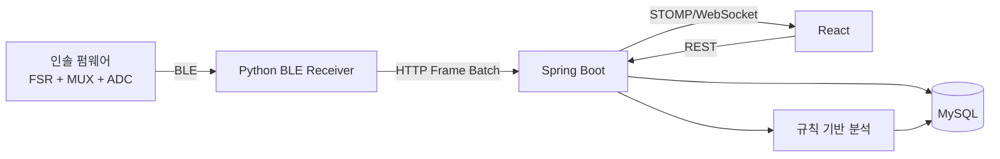
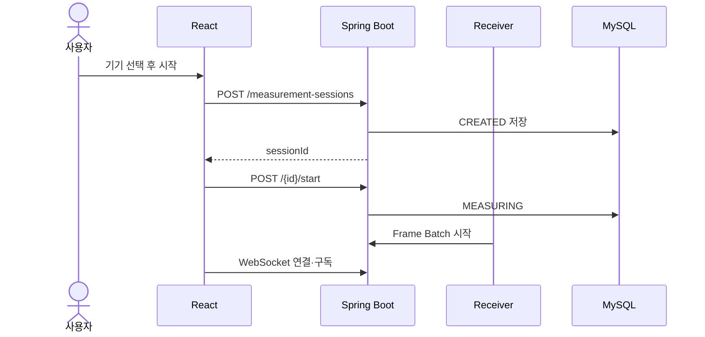
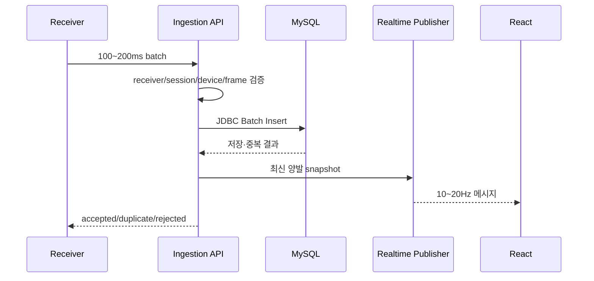
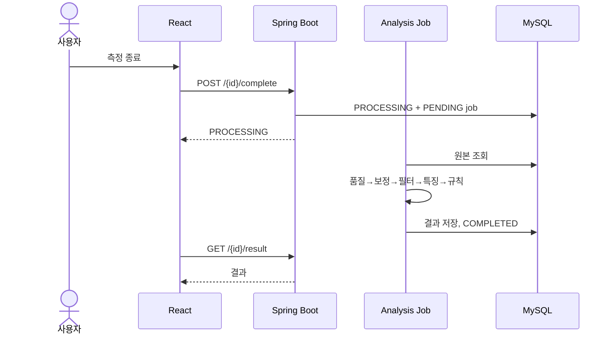
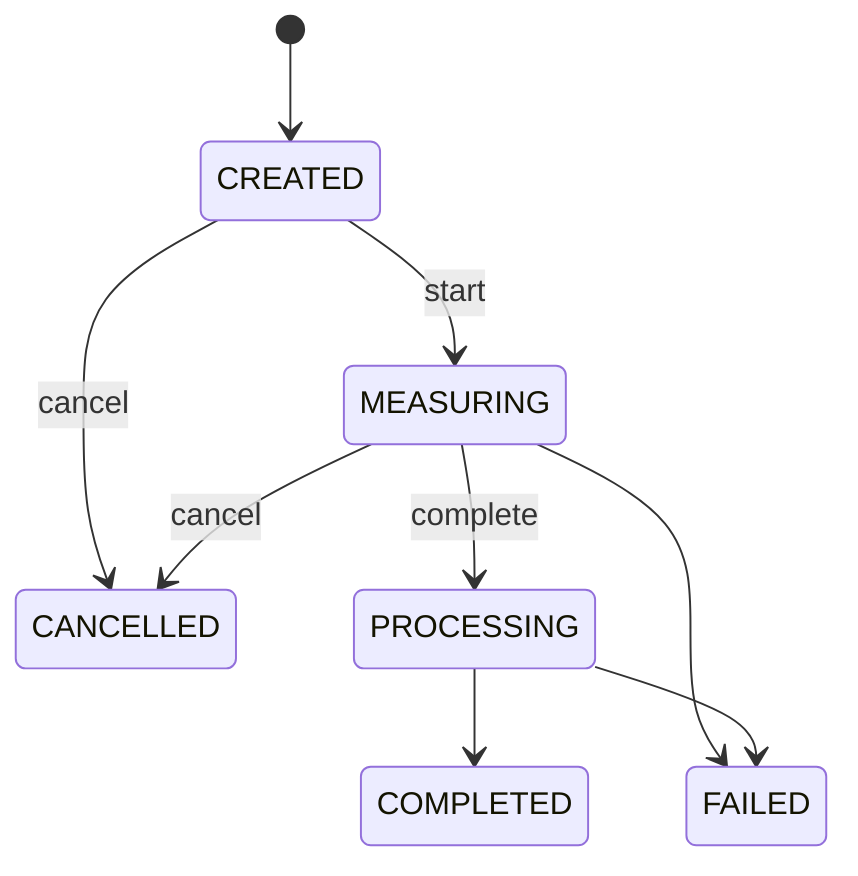
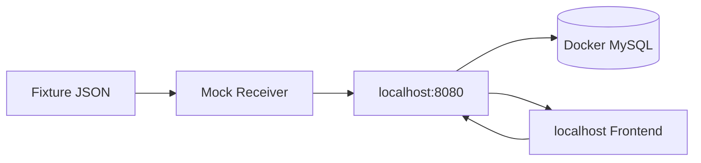

# 01. 시스템 아키텍처

## 전체 구조



## 책임 경계

### 펌웨어
- 100Hz 센서 읽기
- 센서 순서, sequence, 측정 시간 포함
- 사용자·분석 로직을 모름

### Receiver
- BLE 연결과 바이너리 파싱
- 100~200ms 프레임 배치
- 실패 시 임시 보관·재전송
- 분석 판단 금지

### 백엔드
- 세션과 소유권
- Receiver 인증
- 검증·멱등 저장
- 실시간 표시값
- 분석과 결과

### 프론트
- 측정 조작
- REST 상태
- WebSocket 구독
- 결과·운동·기록 표시
- 분석 임계값 판단 금지

## 측정 시작



## 수신과 실시간 전달



DB 저장과 WebSocket 발행은 분리합니다. WebSocket이 끊겨도 원본 저장은 계속되어야 합니다.

## 종료와 분석



## 세션 상태



## 모노레포

```text
smart-insole/
├── contracts/
├── docs/
├── fixtures/
├── backend/
└── frontend/
```

장점:

- 같은 계약을 봅니다.
- 한 PR에서 양쪽 변경을 검증합니다.
- Codex가 불일치를 찾기 쉽습니다.
- 통합 테스트가 단순합니다.

## 하드웨어 없는 개발



필수 fixture:

- 정상
- 좌우 비대칭
- 중복
- sequence gap
- 센서 고정
- 한쪽 발 중단
- out-of-order

## 초기 배포

```text
Browser
  ↓ HTTPS
Reverse Proxy
  ├─ React 정적 파일
  └─ Spring Boot REST + WebSocket
          ↓
        MySQL
```

MVP는 단일 백엔드 인스턴스로 시작합니다. 다중 서버 전환 시 WebSocket 브로커, snapshot 공유, 분석 작업 중복 방지를 다시 설계합니다.
