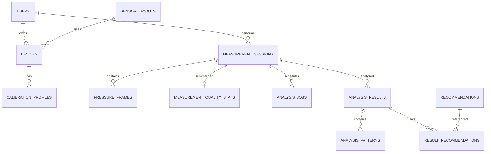

# 03. 데이터 모델

## 목표

- 사용자·기기 소유권
- 측정 당시 기기·보정 버전 고정
- 100Hz 원본 빠른 저장
- 재전송 중복 방지
- 원본 불변과 재분석
- 결과·기록 빠른 조회

## ERD



## users

| 컬럼 | 제약 |
|---|---|
| id UUID | PK |
| email | UNIQUE, NOT NULL |
| password_hash | NOT NULL |
| name | NOT NULL |
| created_at, updated_at | UTC |

비밀번호 원문 저장 금지.

## sensor_layouts

| 컬럼 | 설명 |
|---|---|
| version | `layout-v1` 등 PK |
| sensor_count | 6 또는 8 |
| points_json | index, x, y, region, medialLateral |
| active | 사용 가능 여부 |
| created_at | 생성 시각 |

예:

```json
[
  {"index": 0, "x": 0.50, "y": 0.90, "region": "HEEL", "medialLateral": "CENTER"},
  {"index": 1, "x": 0.35, "y": 0.70, "region": "MIDFOOT", "medialLateral": "MEDIAL"}
]
```

index는 펌웨어 배열 순서와 정확히 일치해야 합니다.
좌표는 착용자의 발을 위에서 본 발 로컬 좌표계입니다. `x=0`은 내측, `x=1`은 외측이며
`y=0`은 발가락, `y=1`은 뒤꿈치입니다. 양발을 나란히 표시할 때 프론트엔드는 왼발의
센서 좌표와 CoP, 발 윤곽만 수평 반전하여 양쪽 내측이 화면 중앙을 향하게 합니다.

## devices

| 컬럼 | 설명 |
|---|---|
| id | UUID PK |
| user_id | 소유자 FK |
| serial_number | UNIQUE |
| display_name | 화면명 |
| foot_side | LEFT/RIGHT |
| sensor_count | 6/8 |
| sensor_layout_version | FK |
| firmware_version | 펌웨어 |
| status | ACTIVE 등 |
| last_seen_at | heartbeat |
| registered_at, updated_at | 시각 |

인덱스:

```text
UNIQUE(serial_number)
INDEX(user_id, foot_side, status)
INDEX(last_seen_at)
```

## calibration_profiles

| 컬럼 | 설명 |
|---|---|
| id | UUID |
| device_id | FK |
| version | 기기별 버전 |
| baseline_values_json | 무부하값 배열 |
| scale_values_json | 크기 보정 배열 |
| active | 활성 |
| created_at | 생성 |

```text
UNIQUE(device_id, version)
```

세션은 측정 당시 profile ID를 저장합니다.

## measurement_sessions

| 컬럼 | 설명 |
|---|---|
| id | UUID |
| user_id | 사용자 |
| left_device_id/right_device_id | 양발 기기 |
| left_calibration_id/right_calibration_id | 당시 보정 |
| status | 상태 |
| sample_rate_hz | 100 |
| source_type | DEVICE/SIMULATED |
| memo | 선택 |
| data_quality_score | 0~100 |
| started_at/ended_at | 시각 |
| created_at/updated_at | 시각 |

검증:

- 양쪽 기기가 다름
- LEFT 기기는 왼발, RIGHT 기기는 오른발
- 모두 해당 사용자 소유
- 상태 전이는 도메인 메서드

인덱스:

```text
INDEX(user_id, created_at DESC)
INDEX(status, updated_at)
```

## pressure_frames

가장 빠르게 증가하는 테이블입니다.

| 컬럼 | 설명 |
|---|---|
| id BIGINT | PK AUTO_INCREMENT |
| session_id | FK |
| device_id | FK |
| foot_side | LEFT/RIGHT |
| sequence_no | 순서 |
| device_time_ms | 기기 시간 |
| received_at | 서버 수신 |
| sensor_1~sensor_6 | 필수 |
| sensor_7~sensor_8 | 6센서 기기면 null |

```text
UNIQUE(session_id, device_id, sequence_no)
INDEX(session_id, device_time_ms)
INDEX(session_id, foot_side, sequence_no)
INDEX(device_id, received_at)
```

저장:

- JDBC batch
- 유효 프레임 일괄 입력
- 중복은 count
- 기본 최대 200프레임

양발 기준 10분이면 약 120,000행이므로 목록 API에서 원본 전체를 반환하지 않습니다.

## measurement_quality_stats

| 컬럼 | 설명 |
|---|---|
| session_id | PK/FK |
| expected_frame_count | 예상 |
| received_frame_count | 수신 |
| duplicate_frame_count | 중복 |
| rejected_frame_count | 거절 |
| sequence_gap_count | gap |
| missing_frame_rate | 누락률 |
| flags_json | 품질 코드 |
| score/level | 요약 |
| updated_at | 갱신 |

## analysis_jobs

| 컬럼 | 설명 |
|---|---|
| id | UUID |
| session_id | 세션 |
| status | PENDING/RUNNING/COMPLETED/FAILED |
| algorithm_version | 버전 |
| attempt_count | 시도 |
| error_code/message | 실패 |
| created/started/completed_at | 시각 |

```text
UNIQUE(session_id, algorithm_version)
```

## analysis_results

| 컬럼 | 설명 |
|---|---|
| id | UUID |
| session_id | 세션 |
| algorithm_version | 버전 |
| quality_score/level | 품질 |
| missing_frame_rate | 누락률 |
| cadence | 걸음수 |
| left/right_contact_time_ms | 접촉 시간 |
| symmetry_index | 좌우 지수 |
| pressure_distribution_json | 영역 비율 |
| quality_flags_json | 플래그 |
| created_at | 생성 |

```text
UNIQUE(session_id, algorithm_version)
```

## analysis_patterns

- analysis_result_id
- pattern_code
- severity
- title
- message
- evidence
- sort_order

프론트가 임의로 진단 문구를 만들지 않도록 표시 정보를 반환합니다.

## recommendations

- code PK
- title
- summary
- instructions_json
- duration_minutes
- caution_text
- active

`result_recommendations`로 분석 결과와 연결합니다.

## gait_cycles

걸음별 상세가 필요할 때 추가합니다.

- session_id
- foot_side
- cycle_index
- heel_strike_device_time_ms
- toe_off_device_time_ms
- contact_duration_ms
- peak_pressure
- cop_path_json

초기 MVP에서는 결과 요약 뒤로 미룰 수 있습니다.

## Flyway 순서 예시

```text
V1__create_users.sql
V2__create_sensor_layouts_and_devices.sql
V3__create_calibration_profiles.sql
V4__create_measurement_sessions.sql
V5__create_pressure_frames.sql
V6__create_quality_stats.sql
V7__create_analysis_tables.sql
V8__seed_sensor_layout_v1.sql
V9__seed_recommendations.sql
```

적용된 migration을 수정하지 않고 새 버전을 추가합니다.

## 조회 원칙

- 기록 목록: 세션과 결과 요약
- 실시간: 최신 snapshot
- 결과: analysis_results와 패턴·추천
- 그래프: 서버 다운샘플링
- 장시간 원본: 시간 범위와 최대 수 제한
