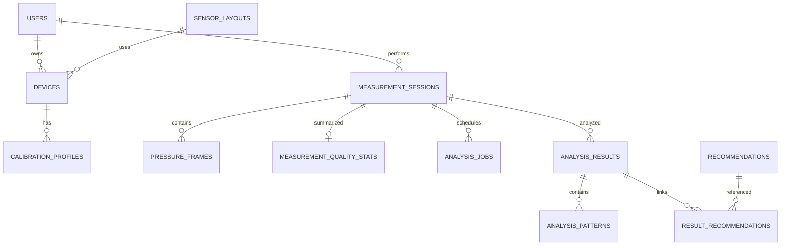

# 03. 데이터 모델

## 목표

- 사용자·기기 소유권
- 측정 당시 기기·보정 버전·ADC 스케일 고정
- 50/100Hz 원본 빠른 저장
- 재전송 중복 방지
- 원본 불변과 재분석
- 결과·기록 빠른 조회

## ERD



## users

| 컬럼 | 제약 |
|---|---|
| id UUID | PK |
| email | UNIQUE, NOT NULL |
| password_hash | NOT NULL |
| name | NOT NULL |
| created_at, updated_at | UTC |

비밀번호 원문 저장 금지.

## sensor_layouts

| 컬럼 | 설명 |
|---|---|
| version | `layout-s01s08-v1` 등 PK |
| sensor_count | 6 또는 8 |
| points_json | index, x, y, region, medialLateral, label(선택) |
| active | 등록 가능 여부(조회는 비활성도 허용) |
| created_at | 생성 시각 |

예(`layout-s01s08-v1`, V6 seed, index = S번호 − 1 = MUX 채널):

```json
[
  {"index": 0, "label": "S01", "x": 0.40, "y": 0.88, "region": "HEEL", "medialLateral": "MEDIAL"},
  {"index": 7, "label": "S08", "x": 0.36, "y": 0.12, "region": "TOE", "medialLateral": "MEDIAL"}
]
```

index는 펌웨어 배열 순서와 정확히 일치해야 합니다.
좌표는 착용자의 발을 위에서 본 발 로컬 좌표계입니다. `x=0`은 내측, `x=1`은 외측이며
`y=0`은 발가락, `y=1`은 뒤꿈치입니다. 양발을 나란히 표시할 때 프론트엔드는 왼발의
센서 좌표와 CoP, 발 윤곽만 수평 반전하여 양쪽 내측이 화면 중앙을 향하게 합니다.
`layout-v1`/`layout-v1-6`은 FK 보존을 위해 `active=false`로만 바뀌며 삭제하지 않습니다. 활성 6센서 seed는 하드웨어 확정 전까지 만들지 않습니다.

## devices

| 컬럼 | 설명 |
|---|---|
| id | UUID PK |
| user_id | 소유자 FK |
| serial_number | UNIQUE (`SMART-INSOLE-{L\|R}-{hex8}` 권장) |
| display_name | 화면명 |
| foot_side | LEFT/RIGHT |
| sensor_count | 6/8 |
| sensor_layout_version | FK |
| firmware_version | 펌웨어(heartbeat로 갱신) |
| adc_max | ADC 최댓값. 등록 허용값 4095, V5 이전 행은 65535 백필 |
| status | ACTIVE 등 |
| last_seen_at | heartbeat |
| last_battery_percent, last_battery_mv | 마지막 반영된 heartbeat 배터리 |
| registered_at, updated_at | 시각 |

인덱스:

```text
UNIQUE(serial_number)
INDEX(user_id, foot_side, status)
INDEX(last_seen_at)
```

## calibration_profiles

| 컬럼 | 설명 |
|---|---|
| id | UUID |
| device_id | FK |
| version | 기기별 버전 |
| baseline_values_json | 무부하값 배열 |
| scale_values_json | 크기 보정 배열 |
| active | 활성 |
| created_at | 생성 |

```text
UNIQUE(device_id, version)
```

세션은 측정 당시 profile ID를 저장합니다.

## measurement_sessions

| 컬럼 | 설명 |
|---|---|
| id | UUID |
| user_id | 사용자 |
| left_device_id/right_device_id | 양발 기기 |
| left_calibration_id/right_calibration_id | 당시 보정 |
| left/right_sensor_layout_version | 당시 레이아웃 |
| status | 상태 |
| sample_rate_hz | 50 또는 100 |
| source_type | DEVICE/SIMULATED (기본 DEVICE) |
| adc_max | 생성 시 기기 adc_max 스냅샷(검증·정규화·포화 판정 기준). V5 이전 행은 65535 백필 |
| receiver_id | 첫 배치 또는 상태 보고의 receiverId |
| receiver_state, receiver_pending_batches, receiver_observed_at | 마지막 receiver-status 보고 |
| memo | 선택 |
| data_quality_score | 0~100 |
| started_at/ended_at | 시각 |
| created_at/updated_at, version | 시각·낙관적 잠금 |

검증:

- 양쪽 기기가 다르고 adc_max가 같음
- LEFT 기기는 왼발, RIGHT 기기는 오른발
- 모두 해당 사용자 소유
- 상태 전이는 도메인 메서드

인덱스:

```text
INDEX(user_id, created_at DESC)
INDEX(status, updated_at)
```

## pressure_frames

가장 빠르게 증가하는 테이블입니다.

| 컬럼 | 설명 |
|---|---|
| id BIGINT | PK AUTO_INCREMENT |
| session_id | FK |
| device_id | FK |
| foot_side | LEFT/RIGHT |
| sequence_no | 단조 u32 (0..4294967295) |
| device_time_ms | 기기 시간 |
| received_at | 배치 서버 수신 |
| sensor_1~sensor_6 | 필수 (0..adc_max) |
| sensor_7~sensor_8 | 6센서 기기면 null |
| protocol_version | (1.1) BLE 프로토콜 버전, 1.0 배치는 NULL |
| receiver_received_at TIMESTAMP(6) | (1.1) 프레임별 수신기 수신 시각, 좌우 정렬 기준 |
| data_mode | (1.1) RAW/FILTERED |
| calibrated, imu_available | (1.1) BOOLEAN |
| accel_x/y/z_mg, gyro_x/y/z_dps10 | (1.1) int16 IMU(mg ±8 g, 0.1 °/s ±500 dps). rule-v1.4.0 분석기가 읽음; 보드는 인솔이 아닌 외측 발목/정강이 장착(DEC-036) |
| flags | (1.1, v2) bit0 FSR_ERROR, bit1 IMU_ERROR, bit2 BATTERY_LOW |

```text
UNIQUE(session_id, device_id, sequence_no)
INDEX(session_id, device_time_ms)
INDEX(session_id, foot_side, sequence_no)
INDEX(device_id, received_at)
```

저장:

- JDBC batch (26컬럼 INSERT)
- 유효 프레임 일괄 입력
- 중복은 count
- 기본 최대 200프레임

양발 기준 10분이면 50Hz 60,000행·100Hz 120,000행이므로 목록 API에서 원본 전체를 반환하지 않습니다.

## measurement_quality_stats

| 컬럼 | 설명 |
|---|---|
| session_id | PK/FK |
| expected_frame_count | 예상 |
| received_frame_count | 수신 |
| duplicate_frame_count | 중복 |
| rejected_frame_count | 거절 |
| sequence_gap_count | gap = Σ(last − first + 1) − received (O(1)), 완료 시 저장 행으로 1회 대조 |
| missing_frame_rate | 누락률 |
| flags_json | 품질 코드 |
| score/level | 요약 |
| first_left/right_sequence | 발별 첫 sequence |
| last_left/right_sequence, last_left/right_device_time_ms | 발별 커서 |
| updated_at | 갱신 |

## analysis_jobs

| 컬럼 | 설명 |
|---|---|
| id | UUID |
| session_id | 세션 |
| status | PENDING/RUNNING/COMPLETED/FAILED |
| algorithm_version | 버전 (현재 `rule-v1.4.0`) |
| attempt_count | 시도 |
| error_code/message | 실패 |
| created/started/completed_at | 시각 |

```text
UNIQUE(session_id, algorithm_version)
```

## analysis_results

| 컬럼 | 설명 |
|---|---|
| id | UUID |
| session_id | 세션 |
| algorithm_version | 버전 |
| quality_score/level | 품질 |
| missing_frame_rate | 누락률 |
| cadence | 걸음수 |
| left/right_contact_time_ms | 접촉 시간 |
| symmetry_index | 좌우 지수 |
| valid_step_count | 유효 걸음(창) 수, rule-v1.1.0 이전 NULL |
| pressure_distribution_json | 영역 비율, 최대 압력, 평균 CoP, 센서 share, 좌우 신호 비율(rule-v1.3.0) |
| quality_flags_json | 플래그 |
| observation_summary_json | (rule-v1.2.0) 6종 코드의 관찰 단계, 이전 버전 NULL |
| left/right_load_share_pct | (rule-v1.3.0, V8) 좌우 신호 비율 L/(L+R)×100, R/(L+R)×100; 이전 버전, 한 발 접촉 구간 없음, 양발 센서 수 다름 NULL |
| left/right/mean_stride_time_ms | (rule-v1.3.0, V8) 같은 발 연속 접촉 구간 시작-시작 간격 중앙값(ms), 평균은 양발 산술 평균·한쪽만 있으면 그 값; 이전 버전 또는 창 2개 미만 NULL |
| movement_summary_json | (rule-v1.4.0, V9) `MovementSummary` 객체 전체 JSON(`imuCoverage`, `referenceMethod`, `left`, `right`: 정강이 움직임 요약, 기능 검증용). 이전 버전·IMU 프레임 없는 세션 NULL. 기록 목록 projection 없음 |
| created_at | 생성 |

```text
UNIQUE(session_id, algorithm_version)
```

## analysis_patterns

- analysis_result_id
- pattern_code (rule-v1.2.0 6종 중 PARTIALLY/REPEATEDLY만 저장)
- severity
- title
- message
- evidence
- sort_order
- observation_level, occurrence_rate, observed_count, window_count (rule-v1.2.0, 이전 NULL)

프론트가 임의로 진단 문구를 만들지 않도록 표시 정보를 반환합니다.

## recommendations

- code PK
- title
- summary
- instructions_json
- duration_minutes
- caution_text
- active

`result_recommendations`로 분석 결과와 연결합니다.

## gait_cycles

걸음별 상세가 필요할 때 추가합니다.

- session_id
- foot_side
- cycle_index
- heel_strike_device_time_ms
- toe_off_device_time_ms
- contact_duration_ms
- peak_pressure
- cop_path_json

초기 MVP에서는 결과 요약 뒤로 미룰 수 있습니다.

## Flyway 순서 (실제)

```text
V1__create_schema.sql
V2__seed_layouts_and_recommendations.sql
V3__add_quality_tracking_and_history_indexes.sql
V4__add_valid_step_count.sql
V5__add_frame_metadata_and_receiver_columns.sql   # 1.1 프레임 메타, adc_max(백필 65535), 배터리, receiver 상태, first sequence
V6__seed_layout_s01s08.sql                        # layout-s01s08-v1 seed, layout-v1/-6 비활성
V7__add_observation_fields.sql                    # 관찰 단계 컬럼, observation_summary_json
V8__add_gait_metrics.sql                          # rule-v1.3.0 left/right_load_share_pct, left/right/mean_stride_time_ms (기록 projection용 스칼라)
V9__add_movement_summary.sql                      # rule-v1.4.0 movement_summary_json (IMU 정강이 움직임 요약 JSON)
```

적용된 migration을 수정하지 않고 새 버전을 추가합니다. `ddl-auto: validate`이므로 엔티티와 migration을 함께 바꿉니다. 65535 리터럴은 V5 SQL에만 존재하고 자바 코드에는 없습니다.

## 조회 원칙

- 기록 목록: 세션과 결과 요약
- 실시간: 최신 snapshot
- 결과: analysis_results와 패턴·추천
- 그래프: 서버 다운샘플링
- 장시간 원본: 시간 범위와 최대 수 제한
